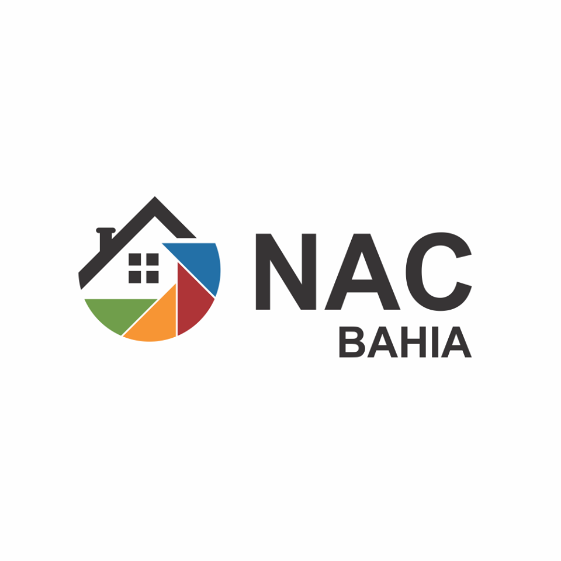

 

___

<h3 align="center">
  <a href="#information_source-sobre">Sobre</a>&nbsp;|&nbsp;
  <a href="#interrobang-motivo">Objetivo</a>&nbsp;|&nbsp;
  <a href="#serviços">Requisitos Funcionais</a>&nbsp;|&nbsp;
  <a href="#cursos">Desenvolvedores do projeto</a>
</h3>

___

## :information_source: Proposta de Trabalho
Atualmente estamos passando por uma  grande efervescência devido COVID-19. Dessa forma a ROCKETSEAT está promovendo a EXPANSION WEEK. Assim fomos instigados pelo Mayk Brito e Dorly Neto, á procurar outros Dev's para buscar um mentor para ajudar no desenvolvimento de um projeto. 

## :information_source: Sobre 
O seguinte projeto consiste no desenvolvimento de um site para a instituição filantrópica NACBahia, localizada AV. Fernandes da Cunha 89 Mares
Salvador-BA. 

### Sobre a Instituição

O Núcleo de Assistência Comunitária da Bahia|(Nac) é uma Instituição filantrópica que tem como missão promover a inclusão social por meio de ações socioeducativas e mediação de acesso ao mundo do trabalho.

Suas áreas de atuação incluem:
<strong>
- Apoio à gestão de organizações de Terceiro Setor;
- Assistência Social;
- Cultura e Artes;
- Defesa de Direitos;
- Desenvolvimento Comunitário;
- Educação, Saúde e Esportes;
- Empreendedorismo/Geração de Emprego e Renda;
</strong>

Os trabalhos sociais são desenvolvidos através de ações de prevenção, e acompanhamento psicossocial individual e/ou em grupo, construindo uma prática comprometida com o indivíduo.

## :interrobang: Objetivo
Divulgar, através de uma plataforma, os serviços oferecidos pela instituição, tais como ações comunitárias e possibilidades para doações. 

## Requisitos Funcionais 
| RF   | Funcionalidades  |
|  :-: |---|
| RF01 | Manter Serviços  |
|      |Visualização de serviços prestados (Disponíveis)   |
|      |Agendamento de um serviço   |
| RF02 | Manter Cursos  |
|      |Visualização dos cursos disponíveis   |
|      |Inscrição em um curso   |
| RF03 |Cadastro de instrutor - Curso   |
|      |Inscrição em um curso   |
|      ||

## Desenvolvedores do projeto 
* nome - full stack developer
* nome - full stack developer
* nome - full stack developer
* nome - full stack developer
* nome - full stack developer

